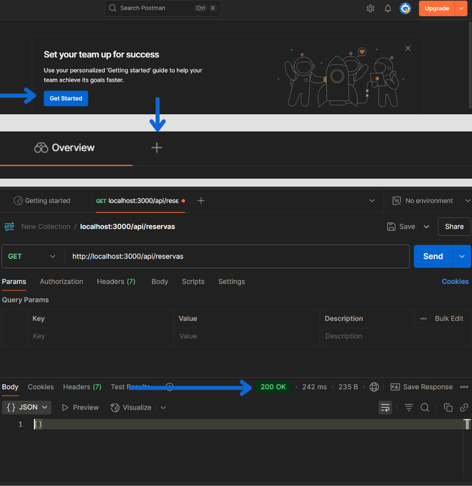

# Inteli - Instituto de Tecnologia e Liderança

 <div align="center">
 <br>
 <br>
 
 <br>
 <br>
 <sup></sup>
 
 </div>
 
# BookUp
## Autora: <a href="https://www.linkedin.com/in/karolbarbosarocha/">Karol Barbosa</a>

## Descrição:

&nbsp;&nbsp;&nbsp;&nbsp;O BookUp é uma plataforma desenvolvida com o objetivo de facilitar e otimizar o processo de reserva das salas de estudo no campus do Inteli. Pensado especialmente para os alunos, o sistema permite o agendamento desses espaços de forma simples, rápida e eficiente.

&nbsp;&nbsp;&nbsp;&nbsp;Com o BookUp, os usuários podem visualizar em tempo real a disponibilidade das salas e realizar reservas em blocos de uma hora, ao selecionar o horário desejado, o sistema exibe apenas as salas disponíveis para aquele momento, diretamente pela plataforma. A ferramenta mantém as regras atuais de uso: as reservas continuam sendo feitas no mesmo dia e algumas salas permanecem fixas para grupos específicos. 

&nbsp;&nbsp;&nbsp;&nbsp; No entanto, com o BookUp, o processo se torna mais claro, rápido e acessível para todos, promovendo um uso organizado dos espaços disponíveis.

## Estrutura de pastas

```
├── config/ # Arquivos de configuração (ex: conexão com banco)
│ └── database.js
├── controllers/ # Lógica de controle das requisições
│ └── HomeController.js
├── models/ # Definição de modelos de dados (estrutura do banco)
│ └── User.js
├── routes/ # Definição das rotas do sistema
│ └── index.js
├── services/ # Serviços auxiliares do sistema
│ └── userService.js
├── assets/ # Arquivos públicos como imagens e fontes
├── scripts/ # Arquivos de JavaScript públicos
├── styles/ # Arquivos CSS públicos
├── tests/ # Arquivos de testes unitários
│ └── example.test.js
├── .gitignore # Arquivo para ignorar arquivos no Git
├── .env.example # Arquivo de exemplo para variáveis de ambiente
├── jest.config.js # Arquivo de configuração do Jest
├── package-lock.json # Gerenciador de dependências do Node.js
├── package.json # Gerenciador de dependências do Node.js
├── readme.md # Documentação do projeto (Markdown)
├── server.js # Arquivo principal que inicializa o servidor
└── rest.http # Teste de endpoints (opcional)
```

## Tecnologias Utilizadas

* **Node.js:** Plataforma de desenvolvimento backend que utiliza JavaScript para a construção de servidores de alta performance.

* **Express.js:** Framework minimalista utilizado para gerenciar as rotas e a lógica do servidor.

* **Padrão MVC:** Arquitetura que separa o código em três camadas: Model, View e Controller

## Instalação

Este documento reúne todas as orientações necessárias para instalar os programas, bibliotecas e ferramentas essenciais à configuração do ambiente de desenvolvimento.

1. **Baixar e instalar o node.js:** [https://nodejs.org/pt-br/](https://nodejs.org/pt-br/)

2. **Clone o repositório:**

```bash
   git clone https://github.com/Karol-barbosa/Projetoindividual.git
```

3. **Acesse a pasta do projeto**

```bash
cd projetoindividual-master
```

4. **Instale as dependências**
    
```bash
npm install
```

5. **Inicie o servidor de desenvolvimento**
    
```bash
npm start
```

 Isso iniciará o servidor de desenvolvimento do software

 ## Configuração do Banco de Dados

Este projeto utiliza o PostgreSQL por meio do Supabase.

1. **Crie uma conta no Supabase:** https://supabase.com

2. **Crie um novo projeto e configure o banco de dados PostgreSQL**

3. **No painel do Supabase, acesse o SQL Editor e crie as tabelas necessárias com o seguinte script:**

``` CREATE TABLE usuario (
    id INT PRIMARY KEY AUTO_INCREMENT,
    email VARCHAR(100) NOT NULL UNIQUE,
    senha VARCHAR(100) NOT NULL
);

CREATE TABLE salas (
    id INT PRIMARY KEY AUTO_INCREMENT,
    numero VARCHAR(10) NOT NULL
);

CREATE TABLE reserva (
    id INT PRIMARY KEY AUTO_INCREMENT,
    usuario_id INT NOT NULL,
    sala_id INT NOT NULL,
    data_checkin DATE NOT NULL,
    data_checkout DATE NOT NULL,
    status VARCHAR(50) NOT NULL,
    
    FOREIGN KEY (usuario_id) REFERENCES usuario(id),
    FOREIGN KEY (sala_id) REFERENCES salas(id)
);
```

4. **Copie a URL de conexão do banco no Supabase e adicione no arquivo .env na raiz do projeto:**

```DATABASE_URL="sua_connection_string_aqui" ```

## Como Rodar as Migrações

Este projeto utiliza PostgreSQL via Supabase como banco de dados. As tabelas são criadas manualmente no painel do Supabase, utilizando o SQL Editor.

## Testando as APIs

Você pode testar os endpoints da API utilizando o Postman:

1. **Baixe e instale o Postman: https://www.postman.com/downloads/**

2. **Com o servidor rodando (npm start), abra o Postman e crie requisições para testar os endpoints da API.**


## Exemplo de Requisição no Postman

* **GET http://localhost:3000/usuarios**
 
 <br>
 <div align="center">
 <sub> Exemplo </sub>
 <br>
 <br>
 
 <br>
 <br>
 <sup></sup>
 
 </div>
 
 <br>
   
## Licença
-------

<p xmlns:cc="http://creativecommons.org/ns#" xmlns:dct="http://purl.org/dc/terms/"><a property="dct:title" rel="cc:attributionURL" href="https://github.com/Karol-barbosa/Projetoindividual.git">BookUp</a> por <a rel="cc:attributionURL dct:creator" property="cc:attributionName" href="https://github.com/Karol-barbosa">Karol Rocha Barbosa</a> é licenciado sob <a href="https://creativecommons.org/licenses/by/4.0/?ref=chooser-v1" target="_blank" rel="license noopener noreferrer" style="display:inline-block;">Creative Commons Atribuição 4.0 Internacional</a></p>

## Agradecimentos

 ### Orientadora
 - <a href="https://www.linkedin.com/in/juliastateri/">Julia Stateri</a>

 ### Instrutores

 - <a href="https://www.linkedin.com/in/anacristinadossantos/">Ana Cristina dos Santos</a>
- <a href="https://www.linkedin.com/in/bruna-mayer/">Bruna Mayer Costa</a>
- <a href="https://www.linkedin.com/in/cristiano-benites-ph-d-687647a8/">Cristiano da Silva Benites</a>
- <a href="https://www.linkedin.com/in/henrique-mohallem-paiva-6854b460/">Henrique Mohallem Paiva</a>
- <a href="https://www.linkedin.com/in/renato-penha/">Renato Penha</a>