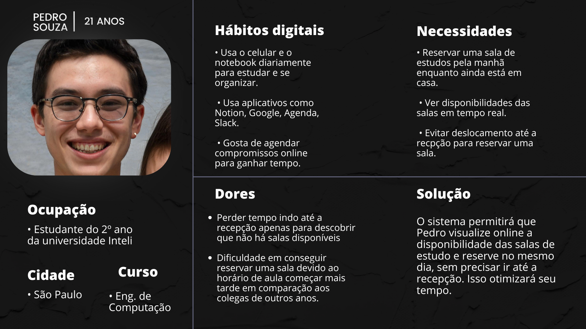

# Web Application Document - Projeto Individual - Módulo 2 - Inteli

**_Os trechos em itálico servem apenas como guia para o preenchimento da seção. Por esse motivo, não devem fazer parte da documentação final._**

## Nome do Projeto

#### Autor do projeto

## Sumário

1. [Introdução](#c1)  
2. [Visão Geral da Aplicação Web](#c2)  
3. [Projeto Técnico da Aplicação Web](#c3)  
4. [Desenvolvimento da Aplicação Web](#c4)  
5. [Referências](#c5)  

 

## 1. Introdução (Semana 01)

&nbsp;&nbsp;&nbsp;&nbsp; O meu projeto é um sistema de reserva de salas para agendamento e tem como objetivo desenvolver um sistema online para reserva de salas de estudos dentro da faculdade. Atualmente os alunos, professores e funcionários precisam ir à recepção para reservar uma salinha, e isso acaba sendo um pouco complicado de conseguir reservar, especialmente para os estudantes de outros anos que começam as aulas mais tarde. Os alunos do primeiro ano, por exemplo, entram às 7h40, enquanto os do segundo ano iniciam às 10h, o que torna mais vantajosa para o primeiro. Além disso, só podemos reservar no mesmo dia, e algumas salas são fixas para algumas pessoas.

 &nbsp;&nbsp;&nbsp;&nbsp; Pensando nisso, o sistema proposto permitirá que os alunos visualizem, em tempo real, as salas disponíveis e realizem suas reservas diretamente pelo site. o sistema iria continuar com a regra atual de reservar no mesmo dia, e também continuaram com as salas fixas, o aluno e o time do inteli poderia ver as salas que já estão reservadas e reservar um horário Com isso, pretende-se melhorar a organização, otimizar o tempo dos usuários e tornar o processo mais acessível.

---

## 2. Visão Geral da Aplicação Web

### 2.1. Personas (Semana 01)

 

Figura 01 - Persona
 
 

 
 
Fonte: Material produzido pela autora (2025)

 

### 2.2. User Stories (Semana 01)

US01: Como estudante, quero reservar uma sala de estudos diretamente pelo site, para que eu consiga agendar sem precisar ir até a recepção.

US02: Como usuário, quero ver a disponibilidade das salas em tempo real, para conseguir ver se há salas livres no momento e realizar a reserva.

US03: Como usuário, quero visualizar quais salas são fixas para determinadas pessoas, para que eu possa entender melhor a disponibilidade e planejar minha reserva.

US04: Como usuário, gostaria de poder cancelar minha reserva de sala até um certo horário antes da ocupação, para liberar a sala para outras pessoas caso eu não precise mais dela.

Análise INVEST da US02

I = A possibilidade de ver a disponibilidade das salas em tempo real pode ser desenvolvida de forma independente, sem depender de outras funcionalidades como agendamento ou cancelamento. 

N = Podemos negociar aspectos como a forma de visualização lista, mapa interativo, etc. ou a atualização da disponibilidade tempo real contínuo ou a cada minuto.

V = Essa funcionalidade é valiosa porque resolve um problema real dos usuários. Saber a disponibilidade das salas em tempo real facilita a reserva e evita que os usuários percam tempo verificando manualmente.

E = É possível estimar o esforço necessário para desenvolver a funcionalidade. Embora envolva integração com o banco de dados e a interface do usuário, o trabalho pode ser dividido em partes menores, como a criação do banco de dados de reservas e a atualização da interface.

S = A User Story pode ser quebrada em tarefas menores, como:
Criar a estrutura do banco de dados para as salas.
Implementar o sistema de atualização em tempo real.
Desenvolver a interface para exibição da disponibilidade.

T = A funcionalidade é testável. Podemos verificar se a disponibilidade das salas está sendo exibida corretamente e se é atualizada conforme o esperado. Também é possível testar casos em que a sala está ocupada e quando está disponível.

---

## 3. Projeto da Aplicação Web

### 3.1. Modelagem do banco de dados  (Semana 3)

*Posicione aqui os diagramas de modelos relacionais do seu banco de dados, apresentando todos os esquemas de tabelas e suas relações. Utilize texto para complementar suas explicações, se necessário.*

*Posicione também o modelo físico com o Schema do BD (arquivo .sql)*

### 3.1.1 BD e Models (Semana 5)
*Descreva aqui os Models implementados no sistema web*

### 3.2. Arquitetura (Semana 5)

*Posicione aqui o diagrama de arquitetura da sua solução de aplicação web. Atualize sempre que necessário.*

**Instruções para criação do diagrama de arquitetura**  
- **Model**: A camada que lida com a lógica de negócios e interage com o banco de dados.
- **View**: A camada responsável pela interface de usuário.
- **Controller**: A camada que recebe as requisições, processa as ações e atualiza o modelo e a visualização.
  
*Adicione as setas e explicações sobre como os dados fluem entre o Model, Controller e View.*

### 3.3. Wireframes (Semana 03)

*Posicione aqui as imagens do wireframe construído para sua solução e, opcionalmente, o link para acesso (mantenha o link sempre público para visualização).*

### 3.4. Guia de estilos (Semana 05)

*Descreva aqui orientações gerais para o leitor sobre como utilizar os componentes do guia de estilos de sua solução.*

### 3.5. Protótipo de alta fidelidade (Semana 05)

*Posicione aqui algumas imagens demonstrativas de seu protótipo de alta fidelidade e o link para acesso ao protótipo completo (mantenha o link sempre público para visualização).*

### 3.6. WebAPI e endpoints (Semana 05)

*Utilize um link para outra página de documentação contendo a descrição completa de cada endpoint. Ou descreva aqui cada endpoint criado para seu sistema.*  

### 3.7 Interface e Navegação (Semana 07)

*Descreva e ilustre aqui o desenvolvimento do frontend do sistema web, explicando brevemente o que foi entregue em termos de código e sistema. Utilize prints de tela para ilustrar.*

---

## 4. Desenvolvimento da Aplicação Web (Semana 8)

### 4.1 Demonstração do Sistema Web (Semana 8)

*VIDEO: Insira o link do vídeo demonstrativo nesta seção*
*Descreva e ilustre aqui o desenvolvimento do sistema web completo, explicando brevemente o que foi entregue em termos de código e sistema. Utilize prints de tela para ilustrar.*

### 4.2 Conclusões e Trabalhos Futuros (Semana 8)

*Indique pontos fortes e pontos a melhorar de maneira geral.*
*Relacione também quaisquer outras ideias que você tenha para melhorias futuras.*

## 5. Referências

_Incluir as principais referências de seu projeto, para que seu parceiro possa consultar caso ele se interessar em aprofundar. Um exemplo de referência de livro e de site:_ 

---
---